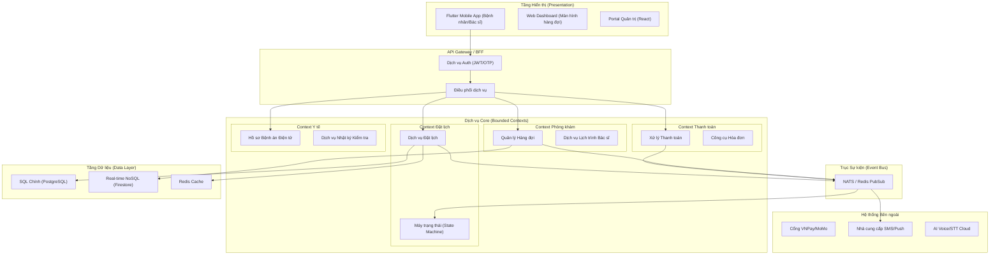
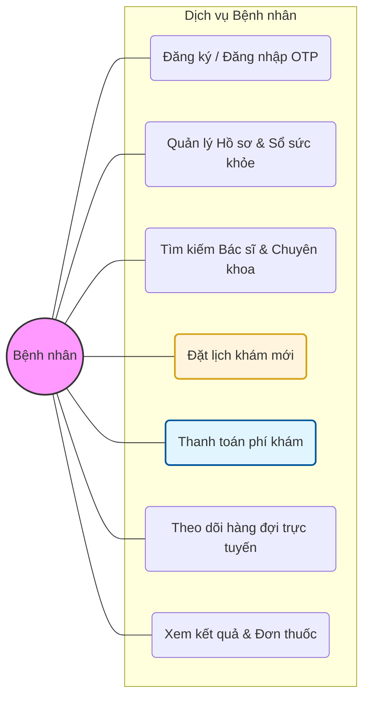
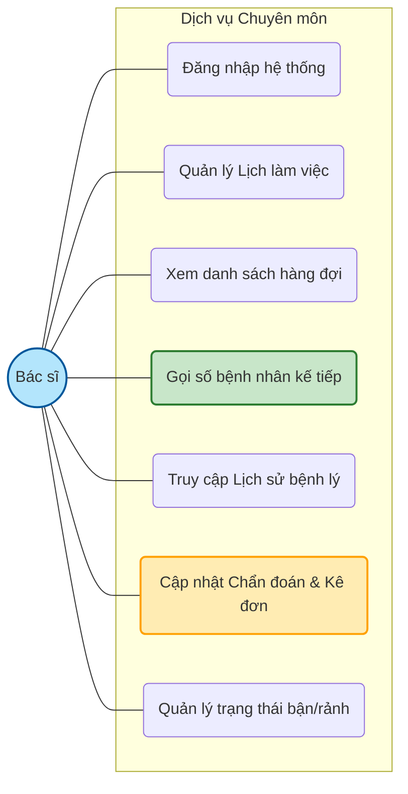
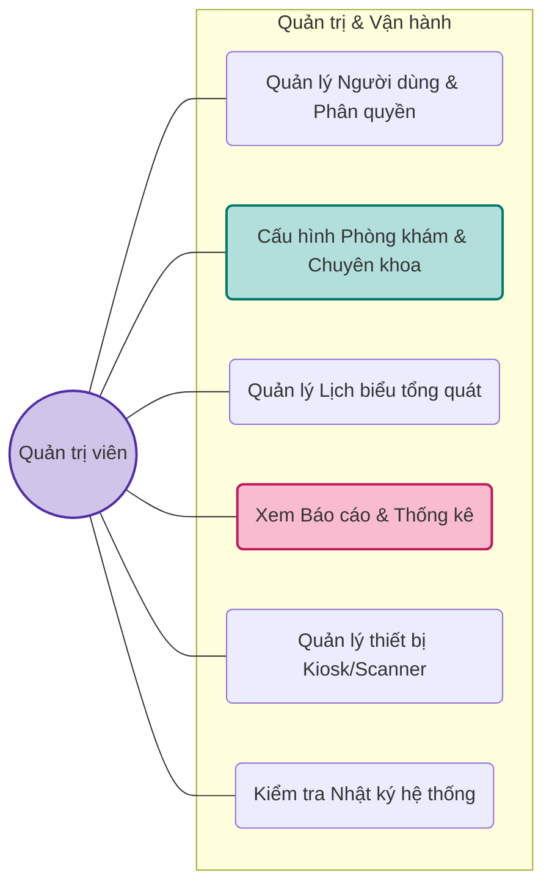
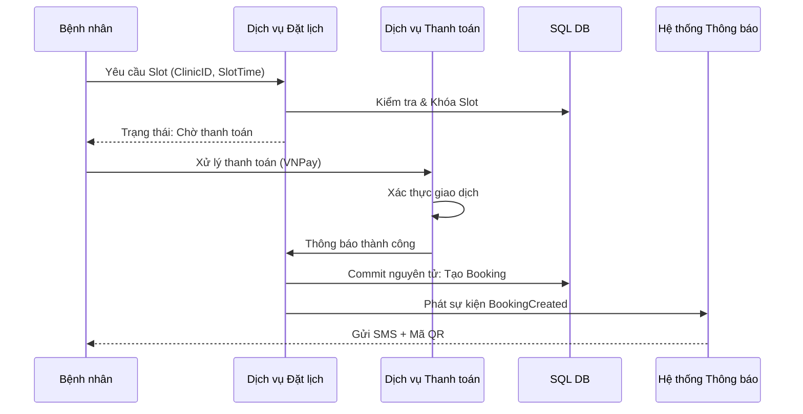
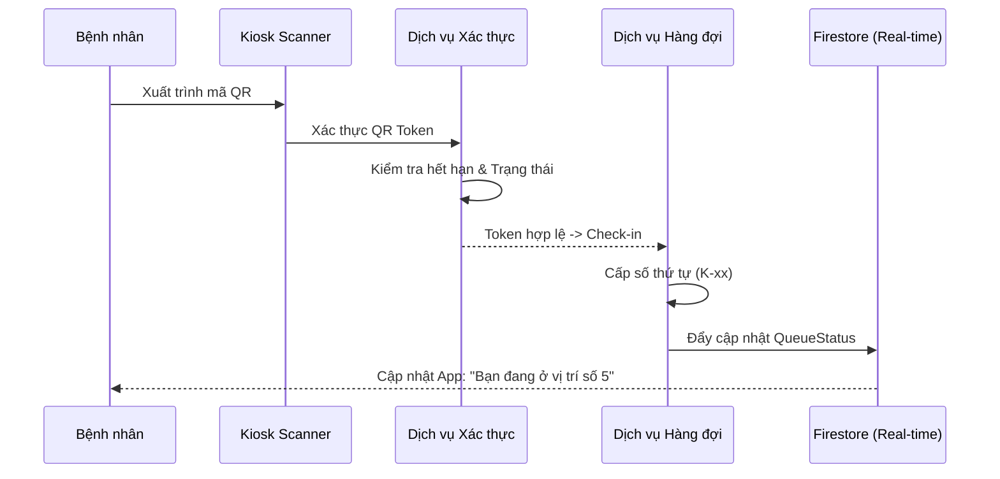
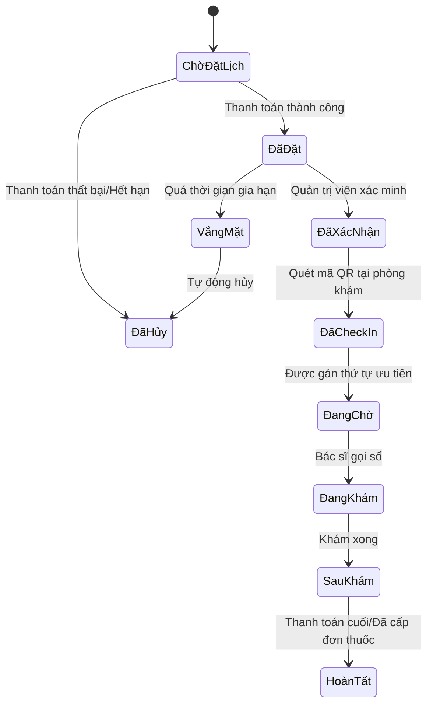
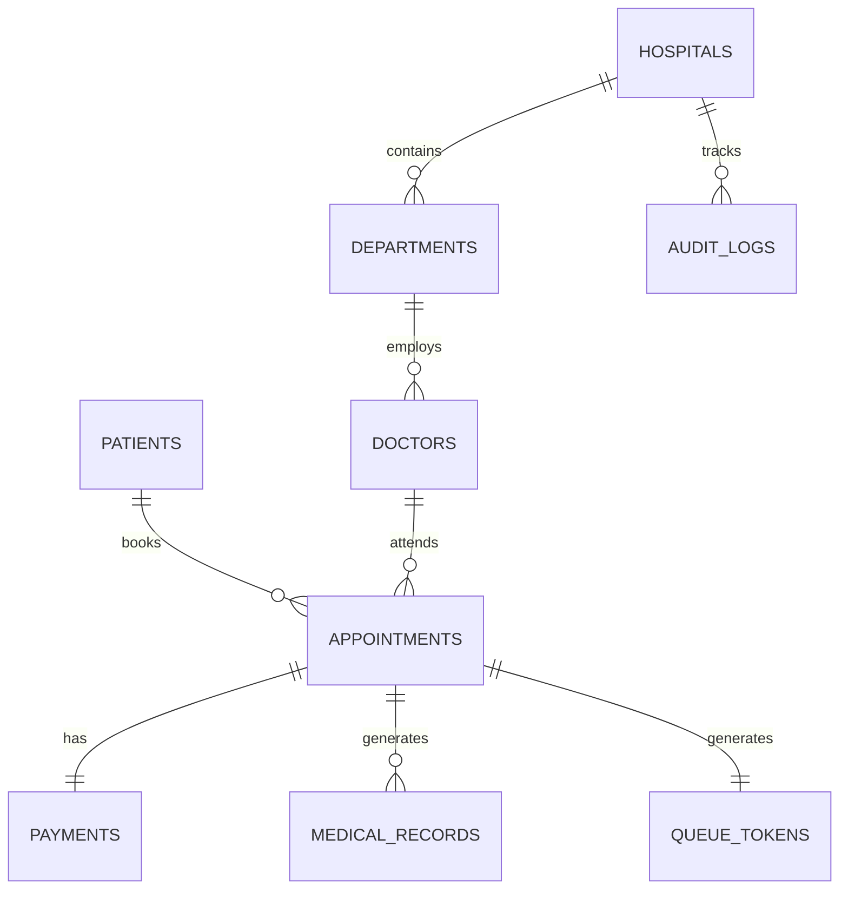

# ICare — Tài liệu Phân tích & Thiết kế Hệ thống (Cấp độ Production)

Tài liệu này trình bày chi tiết về kiến trúc, thiết kế và các thông số kỹ thuật triển khai cho **Hệ thống Đặt lịch Phòng khám Thông minh ICare**. Hệ thống được thiết kế để đảm bảo tính sẵn sàng cao, khả năng mở rộng và ưu tiên trải nghiệm cho người cao tuổi cũng như cư dân vùng nông thôn.

---

# 1. Tổng quan Hệ thống

### Mục tiêu Hệ thống
- **Khả năng Tiếp cận:** Tối ưu cho người cao tuổi và nông thôn với kỹ năng công nghệ thấp.
- **Hiệu quả Vận hành:** Tối ưu hóa lưu lượng bệnh nhân thông qua quản lý hàng đợi thời gian thực.
- **Độ Tin cậy:** Đảm bảo tính nhất quán tuyệt đối cho hồ sơ y tế và giao dịch tài chính.
- **Tính Bao trùm:** Hỗ trợ đa ngôn ngữ và Trợ lý ảo AI (Voice Assistant).

### Đối tượng Người dùng
- **Bệnh nhân:** Người đặt lịch (bao gồm cả nhân khẩu học người già/nông thôn).
- **Bác sĩ:** Nhân viên y tế quản lý ca khám và chăm sóc bệnh nhân.
- **Quản trị viên (Admin):** Quản lý tải công việc, cấu hình phòng khám và lịch trình.
- **Thiết bị/Kiosk:** Máy quét mã QR và màn hình hiển thị hàng đợi thời gian thực.

### Các miền cốt lõi (Core Domains)
- **Danh tính & Truy cập (IAM):** RBAC cho Bệnh nhân, Bác sĩ và Admin.
- **Vòng đời Lịch hẹn:** Từ tìm kiếm, đặt lịch đến khi kết thúc khám.
- **Quản lý Hàng đợi:** Gọi số theo thứ tự ưu tiên và cập nhật thời gian thực.
- **Tài chính:** Xử lý thanh toán nguyên tử (VNPay, MoMo, Stripe).
- **Hồ sơ Y tế:** Lưu trữ mã hóa dữ liệu lâm sàng và nhật ký kiểm tra (audit trails).

### Phong cách Kiến trúc
- **Clean Architecture:** Chia tách nghiêm ngặt giữa các lớp Presentation, Domain và Data.
- **Event-Driven Architecture (EDA):** Sử dụng Pub/Sub để giao tiếp giữa các context (ví dụ: Đặt lịch -> Thông báo).
- **Microservices-Ready:** Thiết kế hướng miền (DDD) cho phép tách nhỏ thành microservices trong tương lai.

---

# 2. Kiến trúc Mức cao

Hệ thống tuân thủ các nguyên lý **Clean Architecture** kết hợp với trục xương sống **Event-Driven** để đảm bảo tính linh hoạt và mở rộng cao.

---

# 3. Thiết kế Mô-đun (Bounded Context Design)

### 3.1 Mô-đun Bệnh nhân
- **Trách nhiệm:** Quản lý hồ sơ, tìm kiếm phòng khám, xem bệnh án, cài đặt trợ năng.
- **Thực thể:** `Patient`, `AccessibilitySettings`.
- **Dịch vụ chính:** `PatientEnrollmentService`, `ProfileSyncService`.

### 3.2 Mô-đun Bác sĩ
- **Trách nhiệm:** Quản lý ca khám, theo dõi tải công việc, cập nhật EMR.
- **Thực thể:** `Doctor`, `Schedule`, `Workload`.
- **Dịch vụ chính:** `ConsultationService`, `WorkloadManagementService`.

### 3.3 Hệ thống Đặt lịch
- **Trách nhiệm:** Quản lý vòng đời lịch hẹn từ khi tạo đến khi hoàn tất.
- **Thực thể:** `Appointment`, `TimeSlot`.
- **Dịch vụ chính:** `SlotReservationService`, `LifecycleOrchestrator`.
- **Sự kiện:** `BookingCreated`, `AppointmentCancelled`.

### 3.4 Hệ thống Hàng đợi
- **Trách nhiệm:** Tính toán thời gian chờ, phân phối ưu tiên và gọi số.
- **Thực thể:** `QueueNumber`, `EstimatedWaitTime`.
- **Dịch vụ chính:** `PriorityCalculationEngine`, `AutoCallService`.
- **Sự kiện:** `QueuePositionUpdated`, `PatientCalled`.

### 3.5 Hệ thống Thanh toán
- **Trách nhiệm:** Xử lý phí khám và hoàn tiền không trùng lặp (Idempotent).
- **Thực thể:** `Transaction`, `Refund`.
- **Dịch vụ chính:** `PaymentGatewayAdapter`, `IdempotencyCheckService`.
- **Sự kiện:** `PaymentSuccessful`, `PaymentFailed`.

### 3.6 Mô-đun Trợ lý AI
- **Trách nhiệm:** Xử lý IVR, phân loại triệu chứng và đặt lịch qua giọng nói.
- **Sự kiện:** `VoiceBookingInitiated`.

---

# 4. Phân tích Use Case

### 4.1 Tác nhân
- **Bệnh nhân:** Tìm kiếm, đặt lịch và tiếp nhận dịch vụ.
- **Bác sĩ:** Chuyên gia quản lý các ca khám.
- **Quản trị viên:** Quản lý nhân sự và cấu hình phòng khám.
- **Hệ thống (Thiết bị):** Màn hình Kiosk và các tác nhân phân loại tự động.
- **Máy quét QR:** Điểm xác thực tại quầy tiếp đón.

### 4.2 Sơ đồ Use Case Chi tiết

Hệ thống ICare được thiết kế với sự phân quyền rõ rệt, đảm bảo tính bảo mật và hiệu quả vận hành. Dưới đây là các sơ đồ Use Case chi tiết cho từng vai trò chính.

#### 4.2.1 Vai trò Bệnh nhân (Patient)
Bệnh nhân là tác nhân trung tâm, tập trung vào trải nghiệm đặt lịch, thanh toán và theo dõi quá trình khám bệnh một cách minh bạch.

#### 4.2.2 Vai trò Bác sĩ (Doctor)
Bác sĩ tập trung vào việc quản lý ca khám và hồ sơ y tế của bệnh nhân một cách nhanh chóng và chính xác.

#### 4.2.3 Vai trò Quản trị viên (Admin)
Quản trị viên chịu trách nhiệm cấu hình hệ thống, giám sát vận hành và phân tích dữ liệu tổng thể.

### 4.3 Use Case Chi tiết: Đặt lịch hẹn
- **Tên:** Đặt lịch hẹn
- **Tác nhân:** Bệnh nhân
- **Điều kiện tiền đề:** Bệnh nhân đã xác thực; còn slot trống.
- **Luồng chính:** 
    1. Tìm kiếm Phòng khám/Chuyên khoa.
    2. Chọn khung giờ.
    3. Xác nhận thông tin.
    4. Xử lý thanh toán (VNPay/MoMo).
- **Điều kiện hậu quả:** Slot được giữ; mã QR được tạo; Thông báo được gửi.

---

# 5. CÁC LUỒNG NGHIỆP VỤ CỐT LÕI

### Luồng 1: Hành trình Bệnh nhân Toàn diện
1. **Đặt lịch:** Bệnh nhân chọn slot và thanh toán.
2. **Xác nhận:** Hệ thống phát `BookingCreated`, gửi SMS kèm link QR.
3. **Đến nơi:** Bệnh nhân quét mã QR tại phòng khám.
4. **Check-in:** QR hợp lệ -> Hệ thống cấp `Số thứ tự` (Ví dụ: K-45).
5. **Chờ đợi:** Bệnh nhân xem vị trí thời gian thực trên app/kiosk.
6. **Vào khám:** Bác sĩ gọi K-45 -> Trạng thái -> `Đang khám`.
7. **Hoàn tất:** Bác sĩ nhấn `Hoàn tất` -> Hệ thống cập nhật hồ sơ EMR.

### Luồng 2: Quản lý Hàng đợi & Ưu tiên
- **Logic:** `Ưu tiên = Cấp cứu(1) > Người già(2) > Bình thường(3)`.
- **FIFO:** Trong cùng mức ưu tiên, sắp xếp theo thời gian Check-in.
- **Cập nhật:** `QueueService` tính lại thời gian chờ dự kiến (EWT) sau mỗi lượt check-in/hoàn tất.

---

# 6. SƠ ĐỒ TUẦN TỰ

### 1. Luồng Đặt lịch hẹn

### 2. Luồng Check-in QR

---

# 7. SƠ ĐỒ HOẠT ĐỘNG

### Sơ đồ Hoạt động Vòng đời Lịch hẹn

---

# 8. THIẾT KẾ MÁY TRẠNG THÁI

### Máy trạng thái Lịch hẹn
| Trạng thái hiện tại | Tác nhân kích hoạt | Trạng thái kế tiếp | Điều kiện |
| :--- | :--- | :--- | :--- |
| `Chờ xử lý` | Thanh toán xong | `Đã đặt` | Mã giao dịch hợp lệ |
| `Đã đặt` | Quét mã Check-in | `Đã Check-in` | Trong khung giờ cho phép |
| `Đã Check-in`| Bác sĩ gọi số | `Đang khám` | Mã bác sĩ khớp |
| `Đang khám` | Bác sĩ hoàn tất | `Hoàn tất` | Đã lưu ghi chú |
| `Đã xác nhận` | Hết thời gian | `Vắng mặt` | Check-in < (Giờ hẹn + 30p) |

---

# 9. THIẾT KẾ CƠ SỞ DỮ LIỆU

### 9.1 Mô hình Quan hệ (ER Diagram)

### 9.2 Định nghĩa các Bảng

| Tên bảng | Mô tả | Khóa chính | Các trường quan trọng |
| :--- | :--- | :--- | :--- |
| **users** | Danh tính cho mọi vai trò | `user_id` | phone, password_hash, role, language |
| **doctors** | Hồ sơ bác sĩ | `doctor_id` | clinic_id, dept_id, avg_cons_time, status |
| **appointments** | Dữ liệu đặt lịch cốt lõi | `appt_id` | patient_id, slot_id, status, qr_token, paid |
| **queue_tokens** | Trạng thái hàng đợi thực | `token_id` | appt_id, queue_num, status, position, ewt |
| **payments** | Giao dịch tài chính | `pay_id` | appt_id, provider, amount, status, idempotency_key |
| **audit_logs** | Bản ghi tuân thủ | `log_id` | actor_id, event_type, payload, checksum |

### 9.3 Thiết kế DB nâng cao
- **Chiến lược Multi-tenant:** `clinic_id` là khóa phân vùng trong mọi bảng. Row-level security (RLS) đảm bảo các phòng khám không bao giờ thấy dữ liệu của nhau.
- **Chiến lược Idempotency:** Thanh toán và đặt lịch sử dụng `request_id` do client tạo để tránh xử lý trùng.
- **Khóa phân tán:** Sử dụng Redis lock khi chọn slot để tránh tình trạng race condition lúc cao điểm.

---

# 10. KIẾN TRÚC HƯỚNG SỰ KIỆN

| Tên sự kiện | Bên phát | Bên nhận | Snippet Payload |
| :--- | :--- | :--- | :--- |
| `BookingCreated` | AppointmentService | Notification, Payment | `{appt_id: "...", patient_id: "..."}` |
| `PaymentSucceeded`| PaymentService | Appointment, Finance | `{tx_id: "...", appt_id: "..."}` |
| `QueueUpdated` | QueueService | KioskDisplay, App | `{queue_pos: 5, ewt: 15}` |
| `NoShowDetected` | CronJobService | Appointment, SlotManager | `{appt_id: "...", slot_available: true}` |

---

# 11. THIẾT KẾ API

### Các Endpoint REST
- `POST /v1/appointments/book`: Yêu cầu đặt lịch ban đầu.
- `GET /v1/clinics/:id/slots`: Kiểm tra slot trống thời gian thực.
- `POST /v1/checkin/qr`: Xác thực mã QR và khởi tạo thứ tự hàng đợi.
- `PATCH /v1/queue/call`: Bác sĩ gọi bệnh nhân tiếp theo.

### Cơ chế Bảo mật
- **Auth:** OAuth2 + JWT (Sống ngắn 1h) + Refresh Token (7d).
- **OTP:** Yêu cầu khi đăng ký cho người già và các khoản thanh toán lớn.
- **Rate Limiting:** 10 requests/giây cho đặt lịch để ngăn chặn bot.

---

# 12. THIẾT KẾ BẢO MẬT

- **Mô hình RBAC:** 
    - `Bệnh nhân`: Đọc dữ liệu cá nhân. Tạo lịch hẹn của mình.
    - `Bác sĩ`: Đọc bệnh nhân được phân công. Ghi chú chẩn đoán.
    - `Admin`: Quyền đọc/ghi toàn cục cho phòng khám cụ thể của họ.
- **Mã hóa:** 
    - Dữ liệu tĩnh: AES-256 cho toàn bộ PII (Thông tin định danh cá nhân).
    - Dữ liệu truyền tải: Bắt buộc TLS 1.3.
- **Nhật ký kiểm tra (Audit Logging):** Mọi thay đổi trạng thái đều được ghi lại bằng mã băm SHA-256 của bản ghi trước đó để chống giả mạo.

---

# 13. HIỆU NĂNG & KHẢ NĂNG MỞ RỘNG

- **Caching:** Redis lưu trữ Lịch trình phòng khám & Slot trống (TTL 5 phút).
- **Phân tách Đọc/Ghi (CQRS):** 
    - **Ghi:** MySQL/PostgreSQL quan hệ cho các giao dịch.
    - **Đọc:** Bản sao denormalized hoặc Firestore để hiển thị giao diện nhanh.
- **Tối ưu Hàng đợi:** Cập nhật hàng đợi theo lô (batch) đẩy lên màn hình mỗi 10 giây qua Server-Sent Events (SSE).

---

# 14. THIẾT KẾ ĐỘ TIN CẬY

- **Chiến lược Thử lại (Retry):** Exponential backoff cho các cuộc gọi SMS/Thanh toán bên ngoài.
- **Circuit Breaker:** Ngắt mạch tại adapter cổng thanh toán để ngăn lỗi dây chuyền nếu VNPay gặp sự cố.
- **Failover:** Dự phòng đa vùng (Multi-region). Dữ liệu được sao chép qua Change Data Capture (CDC).

---

# 15. KHẢ NĂNG QUAN SÁT (OBSERVABILITY)

- **Ghi nhật ký:** Nhật ký JSON có cấu trúc (Logstash/Filebeat).
- **Số liệu (Metrics):** Prometheus/Grafana theo dõi `Đặt lịch/Phút` và `Độ trễ P99`.
- **Cảnh báo:** Tích hợp Slack cho trường hợp `Tỷ lệ thanh toán thành công < 95%`.

---

# 16. CẢI TIẾN & TÁI CẤU TRÚC

- **Điểm yếu:** Phụ thuộc vào nhà cung cấp SMS bên ngoài cho vùng nông thôn.
- **Cải tiến:** Triển khai ví QR ngoại tuyến trong app, hoạt động không cần internet (Đồng bộ Offline-First).
- **Nút thắt:** Tính toán thời gian chờ dự kiến (EWT) cho các bác sĩ có tốc độ khám biến thiên cao. 
- **Mở rộng tương lai:** Sử dụng ML để dự đoán thời gian chờ dựa trên hiệu suất lịch sử của bác sĩ theo từng loại bệnh cụ thể.

---

> **GIẢ ĐỊNH:** Hệ thống sử dụng VNPay/MoMo làm cổng thanh toán chính, nhưng kiến trúc cho phép tích hợp Stripe/PayPal qua `PaymentGatewayAdapter`.

---

**[Kết thúc tài liệu]**
